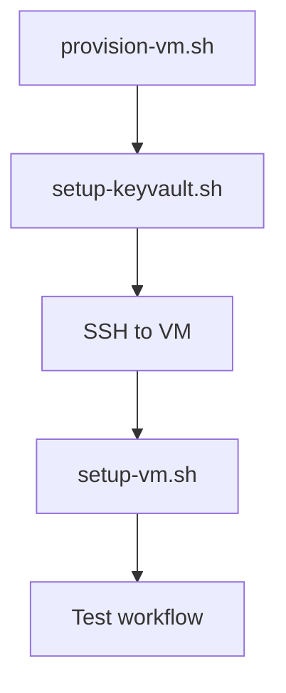

# Azure Infrastructure Scripts

This directory contains scripts to provision and configure a self-hosted GitHub Actions runner for dbRosetta.

## Scripts Overview

| Script | Purpose | Run From | Prerequisites |
|--------|---------|----------|---------------|
| `provision-vm.sh` | Create Azure VM with managed identity | Local machine | Azure CLI, Contributor role |
| `setup-keyvault.sh` | Create Key Vault and add secrets | Local machine | Previous script completed |
| `setup-vm.sh` | Install runner and Flyway on VM | Inside VM (via SSH) | VM provisioned |

## Execution Order



## Quick Start

```bash
# Step 1: Provision VM (takes ~5 minutes)
./provision-vm.sh

# Step 2: Setup Key Vault (takes ~2 minutes)
./setup-keyvault.sh

# Step 3: SSH to VM
source .azure-config
ssh -i $SSH_KEY_PATH $ADMIN_USERNAME@$(az vm show -d -g $RESOURCE_GROUP -n $VM_NAME --query "privateIps" -o tsv)

# Step 4: On VM, copy and run setup script
# (From local machine, copy script to VM first)
# Then on VM:
./setup-vm.sh
```

## Configuration Files

Scripts create configuration files for chaining:

- **`.azure-config`** (local) - VM and Key Vault details
- **`~/.runner-config`** (VM) - Runner and Key Vault details

These files contain sensitive information and are excluded from Git via `.gitignore`.

## Script Details

### provision-vm.sh

**What it creates:**
- Resource Group: `rg-dbrosetta`
- VNet: `vnet-dbrosetta` (10.0.0.0/16)
- Subnet: `subnet-runners` (10.0.2.0/24)
- NSG: `nsg-dbrosetta-runner`
- VM: `vm-dbrosetta-runner` (Standard_B1s)
- SSH Key: `~/.ssh/dbrosetta-runner`

**Cost:** ~$7.50/month

### setup-keyvault.sh

**What it creates:**
- Key Vault with unique name
- Secrets: PostgresConnectionString, PostgresUser, PostgresPassword
- Optional: FlywayLicense
- RBAC assignments for VM identity

**Cost:** ~$0.03/month

### setup-vm.sh

**What it installs:**
- Azure CLI (with managed identity login)
- GitHub Actions runner (self-hosted)
- Flyway Enterprise CLI 11.13.0
- PostgreSQL client 14
- Java OpenJDK 17
- Helper scripts for Key Vault access

**Time:** ~10 minutes

## Security

All scripts follow security best practices:
- ✅ Passwords prompted, never hardcoded
- ✅ Secrets stored in Key Vault only
- ✅ Managed identity for authentication
- ✅ No public IPs on VM
- ✅ NSG restricts traffic
- ✅ Configuration files excluded from Git

## Troubleshooting

### Script fails with "command not found"

Make scripts executable:
```bash
chmod +x *.sh
```

### Azure CLI not authenticated

```bash
az login
az account show
```

### SSH connection refused

Check if you need Azure Bastion or VPN to access private VNet.

### Key Vault access denied

Wait 30 seconds after RBAC assignment for propagation:
```bash
sleep 30
```

## Cleanup

To remove all resources:
```bash
source .azure-config
az group delete --name $RESOURCE_GROUP --yes --no-wait
```

This will delete:
- VM and disk
- Key Vault (with soft-delete protection)
- VNet and subnets
- NSG and rules

## Documentation

- **Complete Guide:** [../docs/RUNNER_SETUP.md](../docs/RUNNER_SETUP.md)
- **Quick Start:** [../docs/RUNNER_QUICKSTART.md](../docs/RUNNER_QUICKSTART.md)
- **Validation Log:** [../docs/validation-log-example.md](../docs/validation-log-example.md)

## Support

For issues or questions, open an issue at:
https://github.com/ScaryDBA/dbRosetta/issues
